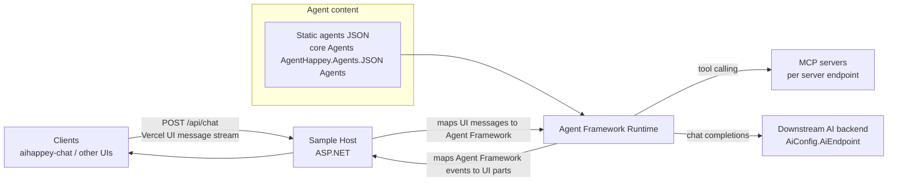

# aihappey-agents

[](https://chat.aihappey.com/agents)

A **model-agnostic Agents backend**: a pure **Microsoft AI Agent Framework runtime** that sits between client protocols (Vercel AI SDK / OpenAI-style / MCP) and Agent Framework–compatible agent content.

This repo focuses on **orchestration** (agents + workflows) and **protocol mapping**. It does **not** call AI models itself.

## 📚 Related projects

- **aihappey-chat** (frontend): expects a Vercel AI SDK–compatible streaming endpoint at **`POST /api/chat`**.
  - Example README style reference: the `aihappey-chat` README you shared.

## ✨ Features

- **Agent Framework execution** (single agent and multi-agent workflows)
- **Workflows**
  - `sequential`, `concurrent`, `groupchat`, `handoff`
  - Optional YAML workflow support (via file message upload)
- **Protocol mapping**
  - Vercel AI SDK **UI message stream** (SSE via `text/event-stream` + `x-vercel-ai-ui-message-stream: v1`)
  - OpenAI-style `chat/completions` mapping (forwarded to a downstream AI backend)
  - Model Context Protocol (**MCP**) server endpoints and registry
- **Streaming + non-streaming** response handling (streaming is used by the samples)
- **Authentication options** (samples)
  - Pass-through `X-*` headers
  - Entra ID (Azure AD) JWT + OBO token acquisition for downstream calls

## 🧭 Architecture



### What this repo does / does not do

**Does**:
- Executes agents and agent workflows
- Maps between:
  - Vercel AI SDK (chat + agent mode)
  - OpenAI-style chat/responses payloads (forwarded)
  - MCP streamable-http
  - Microsoft Agent Framework content

**Does not**:
- No AI model calls (it forwards to your configured `AiEndpoint`)
- No provider / API key management
- No embeddings, transcription, or vision pipelines

## 📂 Repository structure

```
.
├─ core/
│  ├─ AgentHappey.Common/          # Shared models + extensions
│  ├─ AgentHappey.Core/            # Runtime + chat client + MCP wiring
│  └─ Agents/
│     └─ AgentHappey.Agents.JSON/  # Static agent loader + built-in agent definitions
└─ samples/
   ├─ AgentHappey.HeaderAuth/      # Sample host (no auth, forwards X-* headers)
   └─ AgentHappey.AzureAuth/       # Sample host (Entra ID JWT + OBO)
```

## 🚀 Getting Started

### Prerequisites

- **.NET 9 SDK**

### Build

```bash
dotnet build AgentHappey.sln -c Release
```

### Run the sample host (Header auth pass-through)

This is the simplest host to run locally.

```bash
dotnet run --project samples/AgentHappey.HeaderAuth/AgentHappey.HeaderAuth.csproj
```

By default ASP.NET will bind to something like:

- `http://localhost:5000`
- `https://localhost:5001`

To pin the URL explicitly:

```bash
set ASPNETCORE_URLS=http://localhost:5139
dotnet run --project samples/AgentHappey.HeaderAuth/AgentHappey.HeaderAuth.csproj
```

### Run the sample host (Azure / Entra ID)

This host requires JWT bearer auth and uses OBO to acquire a downstream token to call your AI backend.

```bash
dotnet run --project samples/AgentHappey.AzureAuth/AgentHappey.AzureAuth.csproj
```

## ⚙️ Configuration

Configuration is loaded via ASP.NET configuration (typically `appsettings.json` + environment overrides).

### Core config types

The hosts bind these config types (from `core/AgentHappey.Core/Config.cs`):

- `AiConfig`
  - `AiEndpoint` (**required**): base URL for the downstream AI backend (the host will call `POST {AiEndpoint}/chat/completions`)
  - `AiScopes` (optional/required depending on auth): scopes used for OBO when using the AzureAuth sample
- `McpConfig`
  - `McpBaseUrl` (**required**): used to normalize agent MCP server URLs that start with `/`
  - `Scopes` (optional): base scope for MCP usage
  - `DarkIcon`, `LightIcon` (optional): icon URLs used in the MCP registry payload
- `AzureAd` (AzureAuth sample only)
  - `Instance`, `TenantId`, `ClientId`, `ClientSecret`, `Audience`

### Example: `appsettings.json` (HeaderAuth sample)

Create/update `samples/AgentHappey.HeaderAuth/appsettings.json` with at least:

```json
{
  "AiConfig": {
    "AiEndpoint": "https://your-ai-backend.example.com",
    "AiScopes": null
  },
  "McpConfig": {
    "McpBaseUrl": "https://your-mcp-host.example.com",
    "Scopes": null,
    "DarkIcon": null,
    "LightIcon": null
  }
}
```

### Example: `appsettings.json` (AzureAuth sample)

See `samples/AgentHappey.AzureAuth/appsettings.json` for the full shape. At minimum you’ll set:

```json
{
  "AzureAd": {
    "Instance": "https://login.microsoftonline.com/",
    "TenantId": "<tenant-id>",
    "ClientId": "<client-id>",
    "ClientSecret": "<client-secret>",
    "Audience": "<audience>"
  },
  "McpConfig": {
    "McpBaseUrl": "<mcp-base-host>",
    "Scopes": "<mcp-base-scope>",
    "DarkIcon": "<mcp-dark-icon>",
    "LightIcon": "<mcp-light-icon>"
  },
  "AiConfig": {
    "AiEndpoint": "<ai-backend>",
    "AiScopes": "<ai-scope>"
  }
}
```

## 🔌 HTTP API

### `POST /api/chat`

Both sample hosts expose `POST /api/chat`.

- **Request**: `AgentRequest` (see `core/AgentHappey.Common/Models/AgentRequest.cs`)
- **Response**: Server-Sent Events (`text/event-stream`) in a Vercel AI SDK UI message stream compatible format.

The request includes:

- `agents`: which agent(s) to run
- `workflowType`: `sequential | concurrent | groupchat | handoff`
- `messages`: Vercel AI SDK UI message format (AIHappey `UIMessage` model)
- `workflowMetadata`: optional workflow-specific settings

Minimal example (shape only — your client will typically send richer UI message parts):

```bash
curl -N http://localhost:5139/api/chat \
  -H "Content-Type: application/json" \
  -H "Accept: text/event-stream" \
  -d "{\
    \"id\": \"demo\",\
    \"workflowType\": \"sequential\",\
    \"agents\": [\
      {\
        \"name\": \"ResearchAgent\",\
        \"description\": \"Research and summarize\",\
        \"instructions\": \"Be concise\",\
        \"model\": { \"id\": \"gpt-4.1\", \"options\": { \"temperature\": 0.7 } },\
        \"mcpServers\": {}\
      }\
    ],\
    \"messages\": [\
      {\
        \"id\": \"m1\",\
        \"role\": \"user\",\
        \"parts\": [{ \"type\": \"text\", \"text\": \"Hello!\" }]\
      }\
    ]\
  }"
```

#### Authentication behavior

- **HeaderAuth sample**: forwards inbound `X-*` headers to downstream calls.
- **AzureAuth sample**: requires `[Authorize]` and uses Entra ID OBO to call the configured AI backend.

## 🧰 MCP (Model Context Protocol)

This repo also hosts MCP servers via **streamable-http**.

### Registry endpoint: `GET /v0.1/servers`

Returns a list of MCP servers and their connection URLs.

Example:

```bash
curl http://localhost:5139/v0.1/servers
```

### Server endpoints: `/{server}`

MCP servers are exposed at `/{server}` (see `core/AgentHappey.Core/MCP/ServiceExtensions.cs`). The built-in servers are defined in `core/AgentHappey.Core/MCP/ModelContextServers.cs`:

- `DefaultAgents` (resources)
  - exposes a resource list for built-in agents (`agents://list/...`)
- `Runtime` (tools)
- `Editor` (tools; typically auth-gated)
- `SharePointRuntime` (tools; typically auth-gated)

## 🧩 Adding / editing agents

Static agents are loaded from JSON files under:

`core/Agents/AgentHappey.Agents.JSON/Agents/**/Agent.json`

Notes:

- The loader looks for `*Agent.json` files.
- If an agent’s `mcpServers[].url` starts with `/`, it is normalized by prefixing `McpConfig.McpBaseUrl`.
- MCP servers are re-keyed using a **reverse-DNS key** derived from the server URL (last write wins).

## 🔐 Security model (samples)

- `AgentHappey.HeaderAuth`
  - Best for local dev and trusted environments
  - Forwards headers instead of performing auth
- `AgentHappey.AzureAuth`
  - Best for production scenarios with Entra ID
  - JWT-protected API + OBO token acquisition

## 🧪 Status / roadmap (lightweight)

- Add a root `LICENSE` when licensing is decided
- Add an OpenAPI/Swagger description for `/api/chat`
- Add a small “how to test with aihappey-chat agent mode” walkthrough

## Contributing

Issues and PRs are welcome. If you’re changing protocol mapping or streaming behavior, please include:

- A before/after sample payload
- A streaming transcript snippet (SSE)
- Notes on backward compatibility for the `aihappey-chat` client

